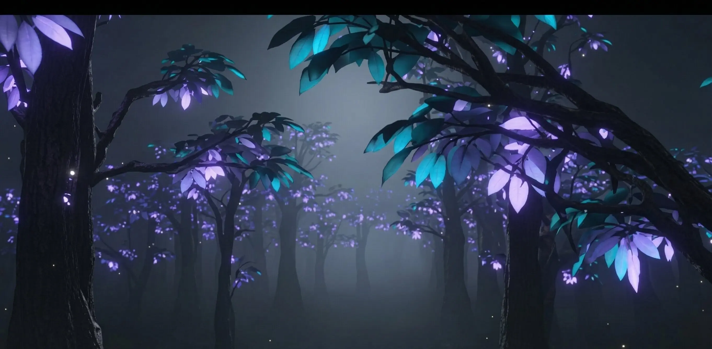

# HALVEN — Luxury Interstellar Travel

A cinematic, immersive landing page for a fictional luxury exoplanet tourism agency. Built with AI-generated video backgrounds, glassmorphism UI, and smooth scroll animations.



## Features

- **Cinematic AI Video Backgrounds** — Generated with AI video tools, compressed for web performance
- **Glassmorphism UI** — Frosted glass cards, transparent navbar, layered depth
- **Smooth Animations** — Scroll-triggered reveals, staggered entrances, cinematic preloader
- **Fully Responsive** — Video backgrounds on desktop, optimized static fallbacks on mobile
- **Accessibility** — Proper heading hierarchy, reduced motion support, keyboard navigation
- **Performance Optimized** — Compressed videos, WebP fallbacks, aggressive caching headers

## Tech Stack

| Technology | Purpose |
|---|---|
| [Next.js 14](https://nextjs.org/) | React framework (App Router) |
| [Tailwind CSS](https://tailwindcss.com/) | Utility-first styling |
| [Framer Motion](https://www.framer.com/motion/) | Scroll animations |
| [TypeScript](https://www.typescriptlang.org/) | Type safety |

## Getting Started

```bash
# Clone the repository
git clone https://github.com/ahmedrayyan89/halven.git

# Navigate to the project
cd halven

# Install dependencies
npm install

# Start the development server
npm run dev
